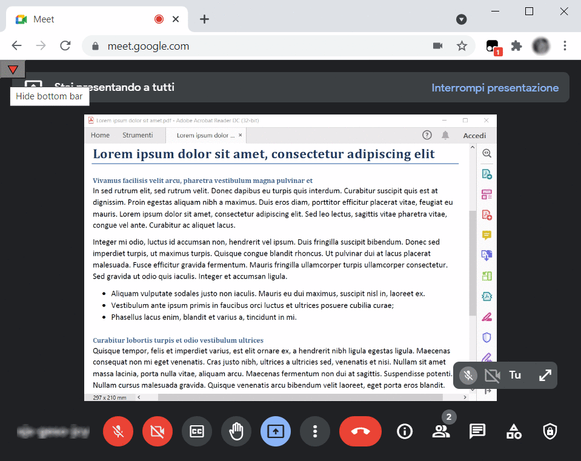

# hide-google-meet-bottom-bar
A Tampermonkey/Greasemonkey script that adds a button to Google Meet's user interface, which lets you hide the bottom bar (mic/cam/quit/options) and the top bar ("xx is now presenting"), to achieve a true fullscreen experience and focus only on the streamed video or presentation.

## How to install
1. Install Tampermonkey:
   * [Chrome](https://tampermonkey.net/?ext=dhdg&browser=chrome)
   * [Firefox](https://tampermonkey.net/?ext=dhdg&browser=firefox)
   * [Opera](https://tampermonkey.net/?ext=dhdg&browser=opera)
   * [Safari](https://tampermonkey.net/?ext=dhdg&browser=safari)
   * [Dolphin](https://tampermonkey.net/?ext=dhdg&browser=dolphin)
   * [UC Browser](https://tampermonkey.net/?ext=dhdg&browser=ucweb)
2. [Download script by clicking here](https://github.com/alessandro-antonelli/hide-google-meet-bottom-bar/raw/main/Hide%20Google%20Meet%20bottom%20bar.user.js). A Tampermonkey tab should pop up in your browser.
3. Click on "Install"
4. You're done!

## How to use
1. join a Google Meet meeting
2. click on the 🔻 button on the top left corner to hide bars
3. click on the 🔺 button on the top left corner to show bars